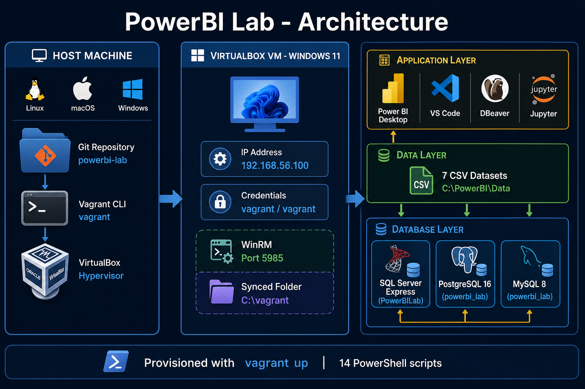
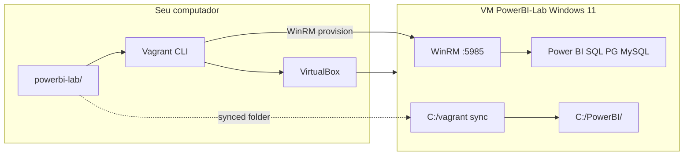
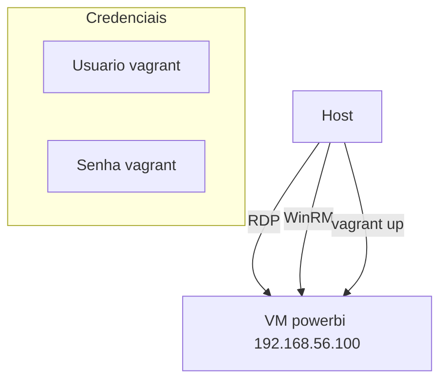
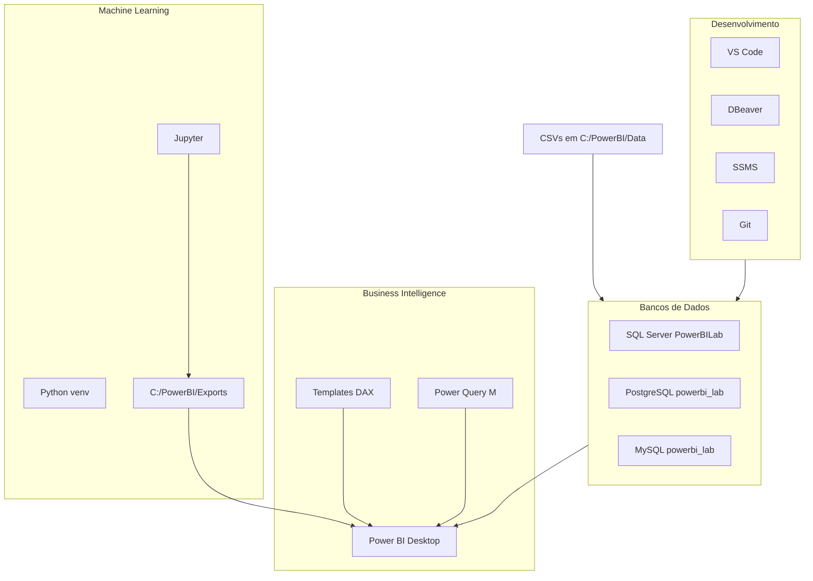
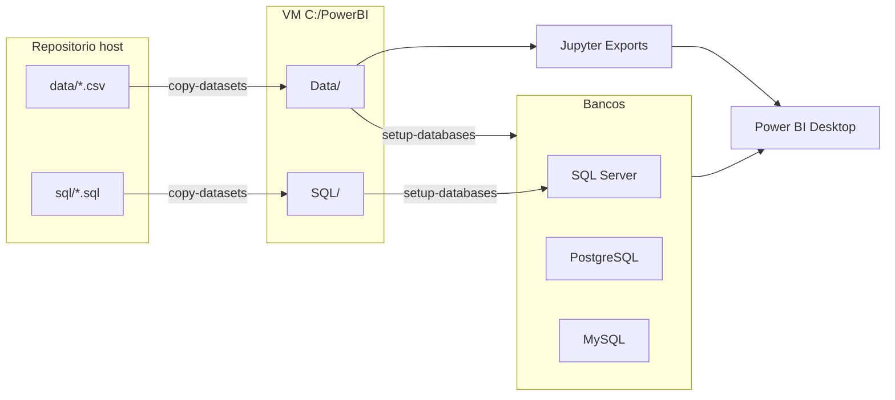
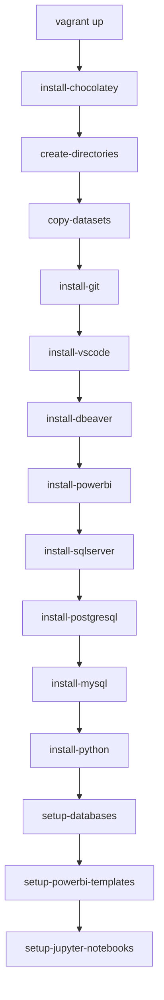

# PowerBI Lab

[](LICENSE)
[](https://www.vagrantup.com/)
[](https://www.virtualbox.org/)
[](https://www.microsoft.com/windows)
[](https://powerbi.microsoft.com/)


---
## Sobre o Projeto

O **PowerBI Lab** é um ambiente de laboratório reproduzível para **Microsoft Power BI**, **SQL**, **Business Intelligence** e **Machine Learning**, provisionado automaticamente com **Vagrant** e **VirtualBox**.

Em vez de instalar manualmente dezenas de ferramentas no Windows, você clona este repositório, executa `vagrant up` e recebe uma VM Windows 11 completa — com Power BI Desktop, três bancos de dados populados, datasets fictícios, templates DAX/Power Query e notebooks Jupyter prontos para uso.

### Para quem é?

| Público | Como o lab ajuda |
|---------|------------------|
| **Estudantes de BI** | Pratica conexões Power BI → SQL Server, PostgreSQL e MySQL com dados reais |
| **Analistas de dados** | Explora dashboards, medidas DAX e transformações Power Query sem setup manual |
| **Devs / DevOps** | Demonstra Infrastructure as Code com Vagrant, WinRM e scripts PowerShell idempotentes |

### O que você ganha?

- **Zero configuração manual** na VM — 14 scripts PowerShell instalam e configuram tudo
- **7 datasets CSV** (~5.000 registros cada) já importados nos 3 bancos
- **Templates** de DAX, Power Query e guias de dashboards
- **5 notebooks Jupyter** com exportação de resultados para o Power BI
- **Ambiente isolado** — destrua e recrie quando quiser com `vagrant destroy`

### Como funciona (resumo)

```
git clone → vagrant up → VM Windows 11 pronta em ~60–90 min
```

Credenciais padrão da VM: `vagrant` / `vagrant` · IP: `192.168.56.100`

---

## Índice

- [Sobre o Projeto](#sobre-o-projeto)
- [Arquitetura](#arquitetura)
- [Visão Geral](#visão-geral)
- [Stack de Software](#stack-de-software)
- [Pré-requisitos](#pré-requisitos)
- [Início Rápido](#início-rápido)
- [Provisionamento](#provisionamento)
- [Estrutura do Projeto](#estrutura-do-projeto)
- [Acesso à VM](#acesso-à-vm)
- [Bancos de Dados](#bancos-de-dados)
- [Datasets](#datasets)
- [Power BI](#power-bi)
- [Jupyter / Machine Learning](#jupyter--machine-learning)
- [Comandos Úteis](#comandos-úteis)
- [Solução de Problemas](#solução-de-problemas)
- [Contribuindo](#contribuindo)
- [Licença](#licença)

---

## Visão Geral

O **PowerBI Lab** provisiona uma VM Windows 11 com:

- **Power BI Desktop** + templates DAX e Power Query
- **3 bancos de dados** (SQL Server, PostgreSQL, MySQL) com dados já importados
- **7 datasets CSV** fictícios (~5.000 registros cada)
- **5 notebooks Jupyter** de Machine Learning integrados ao Power BI
- **Ferramentas**: VS Code, DBeaver, Git, Python 3.11

Ideal para portfólio DevOps, estudos de BI e prática hands-on sem instalar nada manualmente no Windows.

---

## Arquitetura

Diagrama completo da infraestrutura — do host Linux/macOS/Windows ate os bancos de dados consumidos pelo Power BI:



> **Legenda:** o host executa `vagrant up`, que cria a VM via VirtualBox, sincroniza o repositorio em `C:\vagrant` e roda 14 scripts PowerShell via WinRM para instalar software, importar datasets e configurar bancos.
### Visão geral (Host → VM)


### Rede e acesso


| Recurso | Valor |
|---------|-------|
| **Nome da VM** | `PowerBI-Lab` |
| **Box** | `gusztavvargadr/windows-11` (2601.0.0) |
| **IP fixo** | `192.168.56.100` |
| **RAM** | 8 GB |
| **CPUs** | 4 |
| **Disco** | ~80 GB |

### Stack dentro da VM


### Fluxo de dados


---

## Stack de Software

| Categoria | Software | Instalação |
|-----------|----------|------------|
| BI | Power BI Desktop | Chocolatey |
| SQL | SQL Server Express 2022, SSMS, Azure Data Studio | Chocolatey |
| SQL | PostgreSQL 16, pgAdmin 4 | Chocolatey |
| SQL | MySQL 8, MySQL Workbench | Chocolatey |
| Dev | VS Code (+ Python, SQL, Jupyter) | Chocolatey |
| Dev | DBeaver, Git | Chocolatey |
| Runtime | Python 3.11, PowerShell 7, Jupyter | Chocolatey + pip |
| Utilitários | 7-Zip, Notepad++ | Chocolatey |

**Pacotes Python (venv):** `pandas`, `numpy`, `matplotlib`, `seaborn`, `plotly`, `scikit-learn`, `tensorflow`, `jupyter`, `sqlalchemy`, `pyodbc`, `psycopg2-binary`, `mysql-connector-python`

> O navegador **Microsoft Edge** já vem na box Windows 11 — não instalamos Chrome para evitar falhas de provisionamento.

---

## Pré-requisitos

| Requisito | Mínimo | Recomendado |
|-----------|--------|-------------|
| **RAM do host** | 12 GB | 16 GB+ |
| **CPU** | 4 cores | 8 cores+ |
| **Disco livre** | 100 GB | 150 GB+ |
| **Virtualização** | VT-x / AMD-V no BIOS | Habilitada |
| **Internet** | Banda larga | Estável (~15 GB de downloads) |

### Instalar VirtualBox

<details>
<summary><strong>Linux (Ubuntu/Debian)</strong></summary>

```bash
wget -O- https://www.virtualbox.org/download/oracle_vbox_2016.asc | sudo gpg --dearmor -o /usr/share/keyrings/oracle-virtualbox-2016.gpg
echo "deb [arch=amd64 signed-by=/usr/share/keyrings/oracle-virtualbox-2016.gpg] https://download.virtualbox.org/virtualbox/debian $(lsb_release -cs) contrib" | sudo tee /etc/apt/sources.list.d/virtualbox.list
sudo apt update && sudo apt install virtualbox-7.0
sudo usermod -aG vboxusers $USER
```

</details>

<details>
<summary><strong>macOS</strong></summary>

```bash
brew install --cask virtualbox
```

</details>

<details>
<summary><strong>Windows</strong></summary>

Baixe em https://www.virtualbox.org/wiki/Downloads e instale o `.exe`.

</details>

### Instalar Vagrant

<details>
<summary><strong>Linux / macOS / Windows</strong></summary>

- Linux: https://developer.hashicorp.com/vagrant/install
- macOS: `brew install hashicorp/tap/hashicorp-vagrant`
- Windows: instalador em https://developer.hashicorp.com/vagrant/install

```bash
vagrant --version    # 2.4+
VBoxManage --version # 7.0+
```

</details>

### Plugin WinRM (obrigatório)

```bash
vagrant plugin install winrm-elevated
```

> Use **`winrm-elevated`**, não `vagrant-winrm-elevated`.

---

## Início Rápido

```bash
# 1. Clone
git clone https://github.com/SEU-USUARIO/powerbi-lab.git
cd powerbi-lab

# 2. Plugin para scripts elevados no Windows
vagrant plugin install winrm-elevated

# 3. (Opcional) Regenerar datasets
python3 generate_datasets.py

# 4. Subir ambiente — primeira vez: 60–90 min
vagrant up

# 5. Acessar a VM
# IP: 192.168.56.100 | usuário: vagrant | senha: vagrant
```

Após o `vagrant up`, a janela da VM abre no VirtualBox (GUI habilitada).

### Verificar se deu certo

```bash
vagrant winrm -c "Get-Service MSSQL*, postgresql*, MySQL*"
vagrant winrm -c "Test-Path C:\PowerBI\Data\vendas.csv"
vagrant winrm -c "Get-Content C:\PowerBI\Logs\provision.log -Tail 20"
```

---

## Provisionamento

Scripts executados **em ordem** via WinRM (PowerShell como administrador):


| # | Script | O que faz |
|---|--------|-----------|
| 1 | `install-chocolatey.ps1` | Instala Chocolatey |
| 2 | `create-directories.ps1` | Cria `C:\PowerBI\*` |
| 3 | `copy-datasets.ps1` | Copia CSVs e SQLs do host |
| 4 | `install-git.ps1` | Git + config global |
| 5 | `install-vscode.ps1` | VS Code + extensões BI/ML |
| 6 | `install-dbeaver.ps1` | DBeaver Community |
| 7 | `install-powerbi.ps1` | Power BI Desktop |
| 8 | `install-sqlserver.ps1` | SQL Express + mixed mode + sa |
| 9 | `install-postgresql.ps1` | PostgreSQL + senha postgres |
| 10 | `install-mysql.ps1` | MySQL Server + Workbench |
| 11 | `install-python.ps1` | Python 3.11 + venv ML |
| 12 | `setup-databases.ps1` | Importa CSVs nos 3 bancos |
| 13 | `setup-powerbi-templates.ps1` | DAX, Power Query, guias |
| 14 | `setup-jupyter-notebooks.ps1` | 5 notebooks Jupyter |

Reexecutar tudo (idempotente):

```bash
vagrant provision
```

---

## Estrutura do Projeto

```
powerbi-lab/
├── Vagrantfile                 # VM, rede, synced folder, provisionamento
├── README.md
├── LICENSE
├── generate_datasets.py        # Gera os 7 CSVs em data/
│
├── data/                       # Datasets (~5000 linhas cada)
│   ├── vendas.csv
│   ├── marketing.csv
│   ├── financeiro.csv
│   ├── rh.csv
│   ├── logistica.csv
│   ├── contabilidade.csv
│   └── acoes.csv
│
├── sql/
│   ├── create_database.sql     # PowerBILab + tabelas
│   ├── northwind.sql
│   └── adventureworks.sql
│
├── scripts/                    # PowerShell de provisionamento
│   ├── common-functions.ps1
│   ├── install-*.ps1
│   └── setup-*.ps1
│
└── docs/
    ├── architecture.png          # Diagrama de arquitetura (README)
    └── screenshots/
```

### Dentro da VM (`C:\PowerBI\`)

```
C:\PowerBI\
├── Data\              # CSVs copiados do host
├── SQL\               # Scripts SQL
├── Projetos\          # Seus arquivos .pbix
├── Exports\           # Saída dos notebooks → Power BI
├── MachineLearning\
│   ├── venv\
│   ├── notebooks\     # 5 notebooks
│   └── models\
├── Templates\
│   ├── dax\
│   ├── powerquery\
│   ├── dashboards\
│   └── pbit\
└── Logs\
    └── provision.log
```

---

## Acesso à VM

| Campo | Valor |
|-------|-------|
| **IP** | `192.168.56.100` |
| **Hostname** | `powerbi` |
| **Usuário** | `vagrant` |
| **Senha** | `vagrant` |

### RDP

```bash
# Linux
xfreerdp /v:192.168.56.100 /u:vagrant /p:vagrant /size:1920x1080

# Windows: mstsc → 192.168.56.100
```

### WinRM (do host)

```bash
vagrant winrm -c "hostname"
vagrant winrm -c "sqlcmd -S localhost\SQLEXPRESS -E -Q \"SELECT name FROM sys.databases\""
```

---

## Bancos de Dados

### Credenciais padrão

| Banco | Host | Porta | Database | Usuário | Senha |
|-------|------|-------|----------|---------|-------|
| **SQL Server** | `localhost\SQLEXPRESS` | 1433 | `PowerBILab` | `sa` | `PowerBI@Lab2026!` |
| **PostgreSQL** | `127.0.0.1` | 5432 | `powerbi_lab` | `postgres` | `PowerBI@Lab2026!` |
| **MySQL** | `localhost` | 3306 | `powerbi_lab` | `root` | `PowerBI@Lab2026!` |

### Tabelas importadas (7 datasets)

`Vendas`, `Marketing`, `Financeiro`, `RH`, `Logistica`, `Contabilidade`, `Acoes`

### Bancos de exemplo (SQL Server)

- **Northwind** — modelo clássico de vendas
- **AdventureWorks** — star schema

---

## Datasets

| Dataset | Arquivo | Destaques |
|---------|---------|-----------|
| Vendas | `vendas.csv` | produto, região, valor_total, canal |
| Marketing | `marketing.csv` | investimento, impressões, conversões |
| Financeiro | `financeiro.csv` | receita, despesa, lucro, margem |
| RH | `rh.csv` | cargo, departamento, salário, status |
| Logística | `logistica.csv` | transportadora, frete, prazo |
| Contabilidade | `contabilidade.csv` | conta, tipo, centro de custo |
| Ações | `acoes.csv` | ticker, OHLC, volume |

Regenerar:

```bash
python3 generate_datasets.py
vagrant provision
```

---

## Power BI

### SQL Server

1. **Obter Dados** → **SQL Server**
2. Servidor: `localhost\SQLEXPRESS` · Banco: `PowerBILab`
3. Autenticação SQL: `sa` / `PowerBI@Lab2026!`

```powerquery
let
    Source = Sql.Database("localhost\SQLEXPRESS", "PowerBILab"),
    Vendas = Source{[Schema="dbo", Item="Vendas"]}[Data]
in
    Vendas
```

### PostgreSQL

1. **Obter Dados** → **PostgreSQL**
2. Servidor: `localhost` · Banco: `powerbi_lab` · Usuário: `postgres`

### MySQL

1. **Obter Dados** → **MySQL**
2. Servidor: `localhost` · Banco: `powerbi_lab` · Usuário: `root`

### Templates

| Recurso | Caminho na VM |
|---------|-----------------|
| Medidas DAX | `C:\PowerBI\Templates\dax\medidas-exemplo.dax` |
| Power Query M | `C:\PowerBI\Templates\powerquery\exemplos-powerquery.m` |
| Guia de dashboards | `C:\PowerBI\Templates\dashboards\guia-dashboards.md` |

---

## Jupyter / Machine Learning

| Notebook | Técnica | Export para Power BI |
|----------|---------|----------------------|
| `01_regressao_linear.ipynb` | Regressão linear | CSV de predições |
| `02_classificacao.ipynb` | Random Forest | CSV de classificações |
| `03_clusterizacao.ipynb` | K-Means | CSV de clusters |
| `04_deteccao_anomalias.ipynb` | Isolation Forest | CSV de anomalias |
| `05_series_temporais.ipynb` | Série temporal | CSV de previsões |

```powershell
# Dentro da VM
C:\PowerBI\MachineLearning\venv\Scripts\activate
jupyter notebook --notebook-dir=C:\PowerBI\MachineLearning\notebooks
```

Resultados em `C:\PowerBI\Exports\` → importe no Power BI via **Texto/CSV**.

---

## Comandos Úteis

```bash
vagrant status          # status da VM
vagrant up              # criar / iniciar
vagrant halt            # desligar
vagrant suspend         # suspender
vagrant resume          # retomar
vagrant reload          # reiniciar VM
vagrant provision       # reexecutar scripts
vagrant destroy -f      # apagar VM
vagrant winrm -c "..."  # comando remoto
```

---

## Solução de Problemas

### Provisionamento parou no meio

```bash
vagrant provision
```

Logs detalhados: `C:\PowerBI\Logs\provision.log`

### Erro WinRM: "Digest initialization failed"

O `Vagrantfile` já usa transporte plaintext:

```ruby
config.winrm.transport = :plaintext
config.winrm.basic_auth_only = true
```

### Erro de synced folder no Windows (`Mount point already exists`)

O projeto usa **apenas** `.` → `/vagrant`. Não adicione syncs aninhados (`./sql` → `/vagrant/sql`) — conflitam com junctions do VirtualBox no Windows.

### Box antiga `gusguff/win11dev` (404)

Este projeto usa:

```
gusztavvargadr/windows-11 — versão 2601.0.0
```

```bash
vagrant destroy -f
vagrant box remove gusguff/win11dev --provider virtualbox 2>/dev/null
vagrant up
```

### SQL Server: login `sa` falha

O script `install-sqlserver.ps1` habilita mixed mode e redefine a senha. Rode:

```bash
vagrant winrm -c "& C:\vagrant\scripts\install-sqlserver.ps1"
vagrant provision
```

### PostgreSQL: senha incorreta

O script `install-postgresql.ps1` redefine a senha via `pg_hba.conf` temporário. Rode:

```bash
vagrant winrm -c "& C:\vagrant\scripts\install-postgresql.ps1"
```

### Chocolatey / Git / PostgreSQL já instalados

Os scripts são **idempotentes**: detectam software existente e pulam reinstalação quando possível.

### VM lenta ou sem RAM

Edite no `Vagrantfile`: `vb.memory = 8192` → `10240` ou `12288` (se o host permitir).

### Disco cheio

```bash
vagrant halt
# Expandir VDI via VirtualBox GUI ou VBoxManage
vagrant up
```

---

## Contribuindo

1. Fork o repositório
2. Crie uma branch: `git checkout -b feature/minha-melhoria`
3. Commit: `git commit -m 'Descrição clara'`
4. Push: `git push origin feature/minha-melhoria`
5. Abra um Pull Request

---

## Licença

Este projeto está sob a [Licença MIT](LICENSE).

---

*Desenvolvido para a comunidade de Data Analytics e DevOps. Se foi util, deixe uma estrela no GitHub!*
